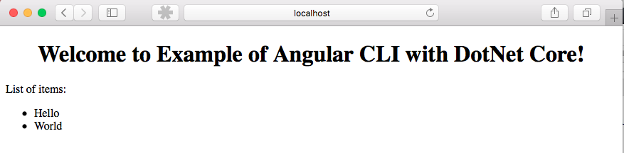

# Welcome to Angular-CLI to .NET Core Example

The information presented in this project illustrates an Angular front-end making a service call to a .NET Core backend.

 "Initial Build"

This project was generated with [Angular CLI](https://github.com/angular/angular-cli) version 1.7.1.

## Development server

Run `npm start` to launch dev server. Navigate to `http://localhost:4200/`. The app will automatically reload if you change any of the source files. It is set up with proxy to go through the ASP.NET Core local dev server at http://localhost:5000 via the proxy.config.json file.

## Build

Run `ng build` to build the project. The build artifacts will be stored in the `dist/` directory. Use the `-prod` flag for a production build.

## Running unit tests

Run `ng test` to execute the unit tests via [Karma](https://karma-runner.github.io). Unit tests will be created for this project.

## Running end-to-end tests

Run `ng e2e` to execute the end-to-end tests via [Protractor](http://www.protractortest.org/).

## Additional Information
contact Edward Apostol by e-mail.
